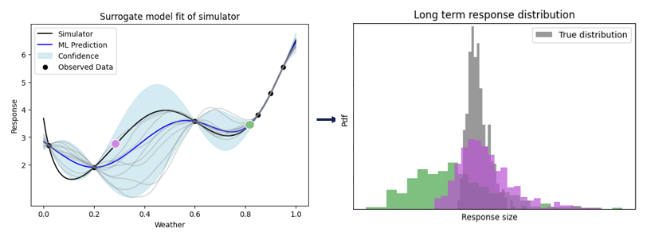

# Design of Experiments (DoE)

Adding more data to the surrogate model reduces its uncertainty, which in turn can reduce uncertainty in the QoI. As collecting data is expensive (it requires running the simulator) we want to be judicious about the data points we choose to add. Design of Experiment (also know as Active Learning) techniques can be used to determine which new data point is expected to be the most beneficial (e.g result in the largest reduction on QoI variance). These heuristics often make use of fast approximate methods rather than precise calculations. It is worth noting that the data point that most reduces uncertainty in our calculation is not necessarily where the surrogate has greatest uncertainty. This is because small model inaccuracies in regions important to the calculation can have a far greater impact than large inaccuracies elsewhere.

The follow example shows 2 possible new data points, the how their addition would impact the ERD estimate. The DoE would aim to pick the purple point, as it produces a more certain estimate of the ERD.

Within `ax`, DoE is controlled by `AcquisitionFunctions`. These score candidate points based on how much benefit they are expected to provide. Due to the different problem formulation, standard acquisition functions are not suitable for the problems `axtreme` solves.

Problem specific acquisition functions can be highly performant, but they do not exist for all problems, and often required expert domain and Bayesian optimisation knowledge to develop. `axtreme` instead provides the general purpose acquisition function `QoILookAhead`, which can be used with any `QoIEstimator`.  While this acquisition function does not make use of problem and domain specifics, it can be surprisingly performant due to the gradient and GPU support provided by `ax` stack.
