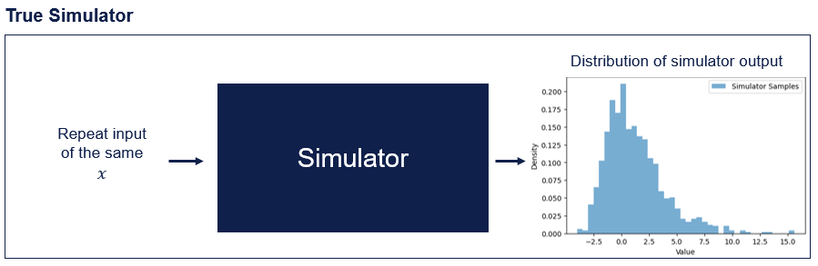

# Surrogate models:

Often we work with models (which we will call simulators) that are too slow or expensive for the calculations we would like to use them for. One way to deal with this is to make a faster/cheaper version of the simulator, and use that in place of the expensive model. The faster model is called the "surrogate model". One challenge with using a surrogate model is that it is an imperfect representation of your simulator, and as a result the calculation made with the surrogate can be inaccurate. The degree of inaccuracy can also be hard to estimate, as different regions of the surrogate might have vastly different influence on the calculation (in some regions small error may have a large impact on the calculation, in others regions large errors may have no impact). In order for a surrogate model to be useful in our calculations of the QoI, we need the following properties.

## Uncertainty aware surrogate:
Uncertainty aware surrogate models provide an estimate of the simulator output (as does a regular surrogate), and provides information about the models confidence in the prediction (e.g a confidence interval). If the confidence is well calibrated, we can accurately estimate how wrong our surrogate might be, and see what effect this has on our calculation. In `axtreme` we use Gaussian Processes (GP) to provide uncertainty aware surrogate models. Some benefits of GPs are that they work well with small amounts of data (meaning we need little data from the expensive simulator), can incorporate prior knowledge about systems (which is not uncommon in engineering). They are also widely used in Bayesian optimisation, which is useful in the later DoE stage.

### Surrogate model
{w=300px}
### Uncertainty aware surrogate mode;

## Non-Gaussian Noise:
Often simulators are stochastic, meaning for a given input $x$ the output $y$ is random, and follows a distribution. The following shows a histogram of the responses seen when running a simulator repeatedly for point $x$.

GPs estimate Gaussian noise/uncertainty around their predictions (Using other distribution is possible, but becomes intractable). If we use a GP to directly model the output of a simulator, this assumes the output of the simulator is also Gaussian distributed. Often the simulators do not follow a Gaussian distribution, so taking this approach will produce poorly calibrated confidence estimate.

Instead, we can use a number of GPs to model the **parameters** of the response distribution. Here we need to explicitly select the distribution that we believe best captures the simulators response. The distribution can be chosen based  on domain knowledge, or by running the simulator repeatedly at a small number of points to get an understanding of the distribution family.

## Compatibility with `Ax`
`Ax` is a package developed by Meta for orchestration of Bayesian Optimisation. By utilising `Ax`, a large amount of orchestration and book-keeping is automatically handled, minimising developer overhead and providing users with an established and documented interface. While there are a large selection of tools available for maximising a GP, our ULS problem does not fit directly into the framework. We do the following to deal with this:
- Define the `Experiment` `Metrics` to be the parameters of the response distribution (e.g location and scale).
- When a `ModelBridge` is instantiated using an `ax` `Experiment` it automatically sets up GPs to track the `Metrics`.
- We customise the Acquisition function in the `ModelBridge` so that it appropriately handles our GPs (Typical acquisition functions try to find the maximum of the GP, but we are interested in a different Quantity)

The following shows a conceptual overview of the key `ax` components involved.

