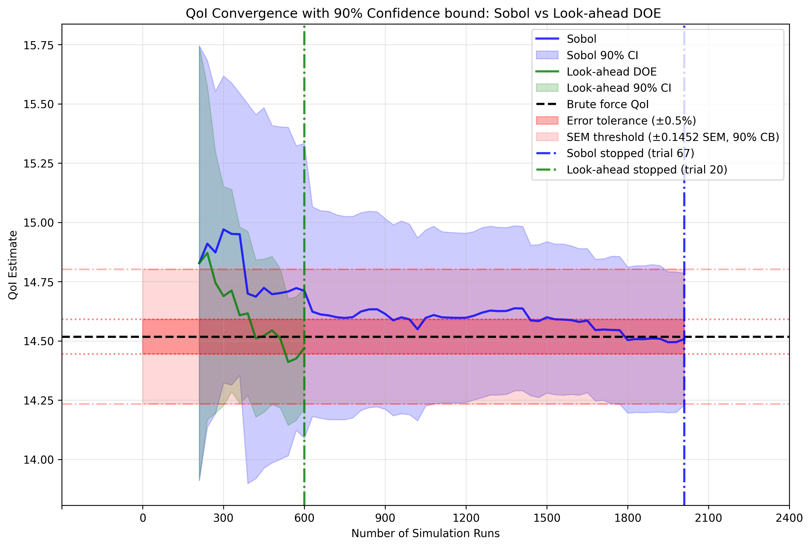
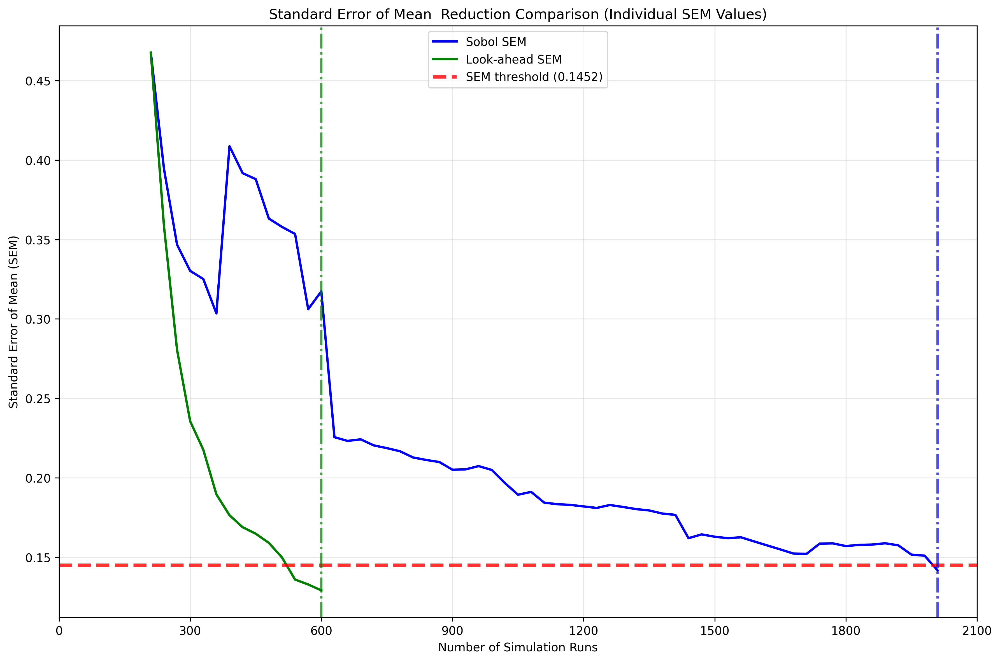
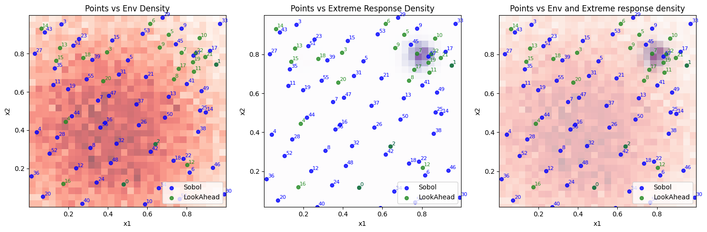
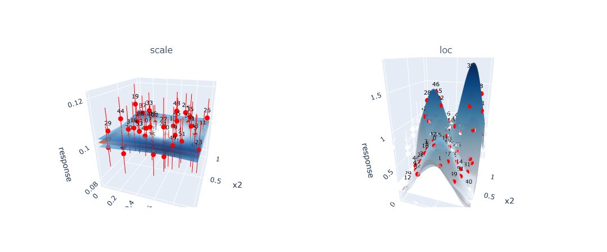
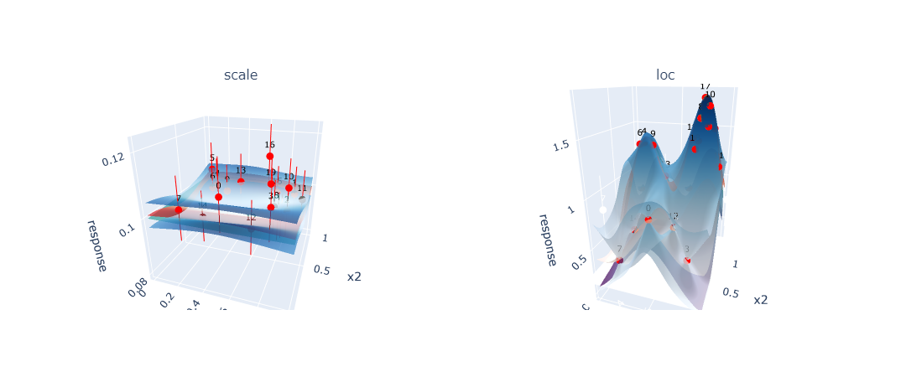

# Design of Experiments (DOE)

## Overview

Design of Experiments (DOE) is a core component of the Axtreme framework that intelligently selects new simulation points to maximize the reduction in uncertainty of the Quantity of Interest (QoI). Unlike traditional space-filling approaches like Sobol sampling, DOE uses acquisition functions to strategically choose points that provide the most information for improving QoI estimates of the surrogate model that approximates the simulator.

## Purpose and Motivation

### Why DOE?

Running simulations is computationally expensive, so we want to be strategic about which points to evaluate. The key insight is that **the data point that most reduces uncertainty in our QoI calculation is not necessarily where the surrogate model has the greatest uncertainty**. Small model inaccuracies in regions important to the QoI calculation can have a greater impact than large inaccuracies elsewhere.

### The Problem DOE Solves

Traditional approaches like Sobol sampling distribute points uniformly across the search space. However, for extreme response problems:
- Extreme responses often occur in specific, small regions of the search space
- These regions may represent a fraction of the total parameter space
- Random sampling requires many more iterations to adequately sample these critical regions
- DOE can identify and focus on these regions much more efficiently

### Problems Where DOE is Most Beneficial

DOE provides the greatest advantage over traditional sampling methods for specific types of problems:

**Problem Attributes:**
- **Extreme value problems**: Problems where you're interested in rare and/or extreme events. Extreme events occur in small regions of the parameter space. DOE can identify and focus sampling on these critical regions much more efficiently than uniform sampling.
- **High-dimensional parameter spaces**: The curse of dimensionality makes uniform sampling inefficient. DOE can identify important parameter combinations without exhaustively sampling the entire space.
- **Expensive simulations**: Problems where each simulation run is computationally costly. When simulation budget is limited, every evaluation must count. DOE maximizes information gain per simulation run.
- **Complex simulators**: Problems where the underlying response of the simulator is complex. Responses create complex regions where small changes in inputs lead to large changes in outputs. DOE can adaptively focus on these critical regions.
- **Sparse Signal Problems**: Problems where the QoI is sensitive to only a small subset of the parameter space. When the "interesting" regions are sparse, random sampling wastes effort on uninformative regions. DOE can identify and focus on the relevant areas.
- **Limited Prior Knowledge**: Problems where you have limited understanding of the underlying physics or relationships. DOE can adaptively learn about the system structure during the sampling process, gradually building understanding of where important behavior occurs.

**DOE May Not Help When:**
- Simple, linear relationships
- All regions equally important to QoI
- Well-understood physics with analytical solutions

**Assessing Problem Suitability for DOE:**

Before applying DOE, consider these questions:

1. **Is my simulation expensive?**
2. **Am I interested in extreme or rare events?**
3. **Is my parameter space high-dimensional?**
4. **Do I expect non-linear or complex behavior?**
5. **Is my simulation budget limited?**
6. **Do I have limited prior knowledge about the problem and its important regions?**

If you answer "yes" to most of these questions, DOE is likely to provide significant benefits over traditional sampling approaches.

## How DOE Works in Axtreme

### Core Components

1. **Surrogate Model**: A Gaussian Process (GP) that approximates the expensive simulator
2. **Acquisition Function**: `QoILookAhead` - evaluates how much each candidate point would reduce QoI uncertainty
3. **QoI Estimator**: Calculates the quantity of interest and its uncertainty from the GP
4. **Optimization**: Finds the point that maximizes the acquisition function

### The DOE Process

```
1. Start with initial training data (warm-up phase using Sobol sampling)
2. Fit GP surrogate model to current data
3. For each candidate point:
   - Predict what the GP would look like if we added this point
   - Calculate how this would change the QoI estimate uncertainty
4. Select the point that reduces QoI uncertainty the most
5. Evaluate the simulator at this point
6. Add new data to the training set
7. Repeat until a given stopping criteria is met
```

### QoILookAhead Acquisition Function

The `QoILookAhead` acquisition function works by:
- Taking a candidate point and predicting what the posterior GP would look like if that point were added
- Calculating the expected QoI uncertainty with this augmented GP
- Selecting points that minimize this expected uncertainty


## Evaluating DOE Performance

### Key Performance Indicators

#### 1. QoI Convergence Rate

Monitor how quickly the QoI estimate converges to the brute force value by plotting QoI estimates over iterations.


*Figure 1: Comparison of QoI convergence between DOE (green) and Sobol sampling (blue) approaches. The black line shows the brute force QoI value. DOE typically converges faster.*

**What to look for:**
- DOE should converge faster than Sobol
- Uncertainty in the QoI estimate should also be reduced faster than Sobol

#### 2. Standard Error of the Mean (SEM)

Track the uncertainty in QoI estimates over iterations to assess convergence.


*Figure 2: Standard Error of the Mean (SEM) over iterations for both DOE and Sobol approaches. DOE typically achieves target SEM thresholds with fewer iterations and shows more consistent reduction.*

**What to look for:**
- DOE should achieve target SEM with fewer iterations
- More consistent SEM reduction compared to random methods
- Smoother convergence curve without large fluctuations

It's important to note that monitoring QoI convergence and SEM reduction is valuable also for problems where no brute force solution is available for comparison. In such cases, you can still assess DOE performance by comparing the rate of convergence and final uncertainty levels between DOE and baseline methods like Sobol sampling. The SEM provides a direct measure of estimation uncertainty that doesn't require knowledge of the true value, making it useful for real-world applications. While comparing against known brute force solutions provides clearer validation and is helpful for learning and understanding DOE behavior, the convergence patterns and uncertainty reduction trends remain the important indicators of DOE effectiveness in practical applications.

#### 3. Point Selection Quality

Visualize where DOE selects points to understand if it's focusing on important regions, as demonstrated in [Figure 3](#fig-point-selection).

{#fig-point-selection}
*Figure 3: Point selection in search space of the DOE(Green) and Sobol(Blue) over environement and exptreme response distribution heatmaps. Here one can observe that the DOE focuses on the specific region where the extreme responses occur, while Sobol selects points more uniformaly.*

One can also look at the point selection on the GP surface for more insight into how the GP fits the function the GP is approximating. The key difference between DOE ([Figure 4b](#fig-doe-gp-surface)) and Sobol ([Figure 4a](#fig-sobol-gp-surface)) becomes apparent when examining how each approach affects the GP's ability to model the underlying function. DOE strategically selects points to achieve high accuracy in regions that are critical for QoI estimation, even if this means accepting lower accuracy in less important areas of the search space. In contrast, Sobol sampling distributes points uniformly across the entire domain, resulting in a GP that fits the underlying function more evenly across the whole search space but requires significantly more points to achieve the same level of QoI accuracy.

{#fig-sobol-gp-surface}
*Figure 4a: GP surface fitted using Sobol sampling showing uniform point distribution and consistent model accuracy across the entire search space. However many simulations are needed to achive this accuracy. The red surface represents the true underlyning function the GP is approximating, green surface is the GP mena prediction of the underlyning function across the search space, the blue surfaces is the upper and lower confidence bounds of the GP and the red points is the simulation points added to the GP with red vertical error bars representing the observation noise of these simulated points.*

{#fig-doe-gp-surface}
*Figure 4b: GP surface fitted using DOE showing concentrated point selection in regions important for QoI calculation. The model achieves high accuracy in critical areas while maintaining lower accuracy elsewhere.*

This visualization technique is valuable because it can be applied even without prior knowledge of the underlying true function. By examining where DOE concentrates its point selection compared to uniform Sobol sampling, researchers can identify which regions of the parameter space contribute most significantly to QoI accuracy. This spatial analysis reveals whether the DOE algorithm is successfully identifying and focusing on specific regions or patterns that are most relevant for the QoI, providing insight into both the DOE behavior and the underlying problem structure.

**What to look for:**
- Points concentrated in regions where extreme responses occur
- Points placed where GP uncertainty impacts QoI calculation most
- Avoidance of point selection in regions of the parameter space less relevant for the QoI estimate

## Tunable Parameters

Understanding and properly tuning DOE parameters is crucial for optimal performance. This section covers the key parameters that control DOE behavior and how to adjust them based on your problem characteristics.

### Critical Parameters

#### 1. Warm-up Runs (`warm_up_runs`)
**Purpose**: Number of initial Sobol points before starting DOE

**Why it matters**: The GP surrogate model needs sufficient initial data to make reasonable predictions about the response surface. Too few warm-up points result in a poorly initialized GP that makes poor decisions about where to sample next. Too many warm-up points waste simulation budget on random sampling instead of DOE point selection.

**Tuning Guidelines**:
- **Too few**: GP may be poorly initialized, leading to poor early DOE decisions and slower convergence
- **Too many**: Wastes budget on random sampling instead of intelligent point selection
- **Problem dependency**: More complex response surfaces (highly non-linear, multi-modal) require more warm-up points for stable GP fitting

#### 2. DOE Iterations (`doe_runs`)
**Purpose**: Number of DOE iterations to run after warm-up phase

**Why it matters**: This determines how much of your computational budget is allocated to intelligent sampling versus random initialization. The optimal number depends on your total budget, problem complexity, and convergence requirements.

**Tuning Guidelines**:
- Monitor convergence of QoI estimates to determine when additional iterations provide diminishing returns
- Use stopping criteria based on SEM or convergence tolerance rather than fixed iteration counts
- Consider computational budget constraints - more iterations provide better accuracy but at higher cost
- For expensive simulations, more DOE iterations may be required compared to warm pu runs.
- For simple problems, fewer DOE iterations may be sufficient as the GP learns the response surface quickly

#### 3. SEM Threshold (`sem_threshold`)
**Purpose**: Stopping criteria based on standard error of the mean


**Why it matters**: This controls when DOE stops based on the uncertainty in the QoI estimate. It directly trades off computational cost against estimate precision. The threshold should be chosen based on your application's accuracy requirements.

**Tuning Guidelines**:
- **Lower values**: More precise estimates but require more iterations
- **Higher values**: Faster convergence but less precise estimates
- **Budget constraints**: If you have limited computational budget, use higher thresholds to ensure convergence within available resources
- **Monitor actual SEM values**: Start with default and adjust based on observed convergence patterns

#### 4. Number of Simulations per Point (`N_SIMULATIONS_PER_POINT`)
- **Purpose**: Number of simulations per point for each point added to the experiment.
- **Why it matters**: Higher values will lead to less uncertainty in the GP fit, but will also increase the time it takes to run the experiment.
- **Tuning**: This will always be a compromise between computational cost and QoI accuracy. Ideally you want as few simulations as possible (with a expensive simulator), but simulationsly you want a accurate GP. Increase if GP estimates are noisy or unstable, decrease if computation time is prohibitive. Although high values might not be possible in practical applications, it can be usefull for debugging and testing purposes, reducing this source of uncertainty.

#### 5.Random Seed (`seed`)
- **Purpose**: Controls reproducibility of environment sampling
- **Why it matters**: Fixed seeds enable reproducible results; varying seeds assess robustness
- **Tuning**: Fix for development and debugging, vary for robustness assessment and final evaluation

## Troubleshooting Common Issues
The key to successful parameter tuning is understanding your problem characteristics, computational constraints, and accuracy requirements, then systematically adjusting parameters while monitoring their effects on DOE performance.

### Poor DOE Performance
**Symptoms**: DOE performs similarly to or worse than Sobol sampling

**Potential Causes**:
1. **Insufficient warm-up**: Increase `warm_up_runs`
2. **Simple problem**: The underlying functions may be too simple to benefit from DOE
3. **Broad extreme regions**: Extreme responses may span too much of the search space
4. **Acquisition function issues**: Check optimization settings

### Slow Convergence
**Symptoms**: QoI estimates take many iterations to converge

**Potential Solutions**:
1. **Adjust SEM threshold**: May be too strict
2. **Increase environment samples**: More samples may improve QoI accuracy
3. **Check GP fit quality**: Visualize GP surfaces to ensure good fits
4. **Verify stopping criteria**: May need problem-specific criteria


## Best Practices

1. **Always compare to baseline**: Run Sobol sampling as a benchmark
2. **Use multiple seeds**: Test robustness across different initializations
3. **Monitor convergence**: Don't just look at final results, watch the trajectory
4. **Visualize point selection**: Understand where and why DOE selects points
5. **Problem-specific tuning**: Adjust parameters based on your specific problem characteristics
6. **Validate with ground truth**: When possible, compare against brute-force calculations

## Conclusion

DOE in Axtreme provides a  framework for efficiently reducing QoI uncertainty in expensive simulation problems. Success depends on proper parameter tuning, understanding when DOE is expected to outperform random sampling, and careful monitoring of convergence behavior. The key is to focus computational budget on regions that most impact the QoI calculation, rather than trying to model the entire response surface equally well.
