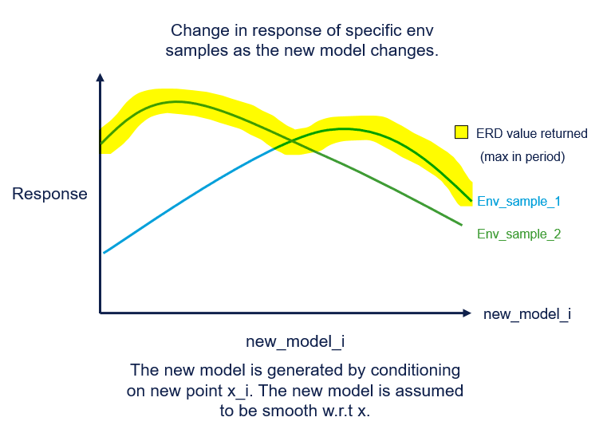
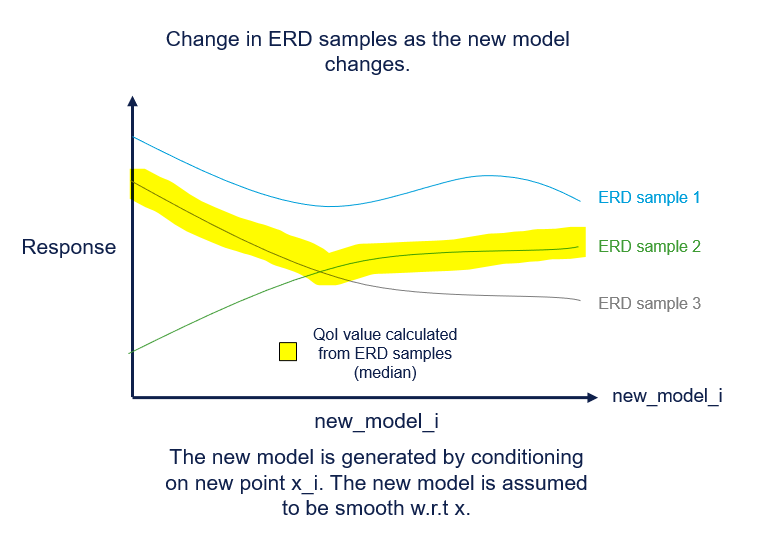

# `GPBruteforce` behaviour w.r.t changes in the underlying model.
The `GPBruteforce` QoI output is not smooth w.r.t  smooth changes in the model used. This impacts the optimisers that should be used.

## Details
The  `QoILookAhead` acquistion function take a candidate point $x$ and returns a score (`acqusition(x) -> score`). Internally the acquisiton function "fantasizes" what new GP would be produced at candidate point $x$ and the calculates the QoI with the new GP. Is uses the variance of the QoI as the score. As this acquistion function needs to be optimised, it important to understand if the acquisiton function is smooth (is the relationship between $x$ and score smooth). The smoothness is influenced by the steps taken when performing this calculation.

`x --> new_model --> qoi(new_model) --> var(qoi) --> score`

While `QoILookAhead` guarantees the `new_model` is smooth w.r.t $x$, the `GPBruteForce` QoI is **not** smooth w.r.t the `new_model`. As a result the acqusition function is not smooth and cannot be optimised with optimisers that expect 1st or 2nd derivative. The following details why the `GPBruteForce` QoI is **not** smooth w.r.t the `new_model`.

### ERD smoothness w.r.t model
A single ERD sample is created byt finding the response of each env sample in a period, and taking the max. say `env_samples = [.1,.3,.6,.4]`. Say the new model is built by adding a single new point between [0,1]. For each different new_model, the response for a specific env sample changes. This can be plotted as follows.

As the plot shows, even if the `env_samples` responses are smooth w.r.t the model, the ERD sample is not gaurenteed to be.

### QoI smoothness w.r.t model
A QoI is estimated from ERD samples (typically a seperate estimate is made for each posterior sample). The following plot shows even if the ERD samples are smooth w.r.t the model, the QoI (in this case the median) is not gaurenteed to be.

