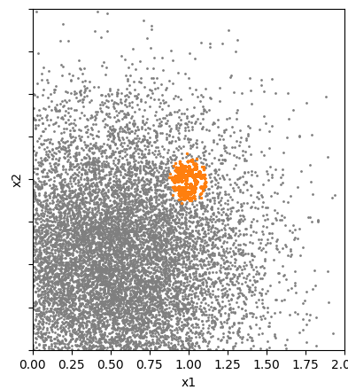
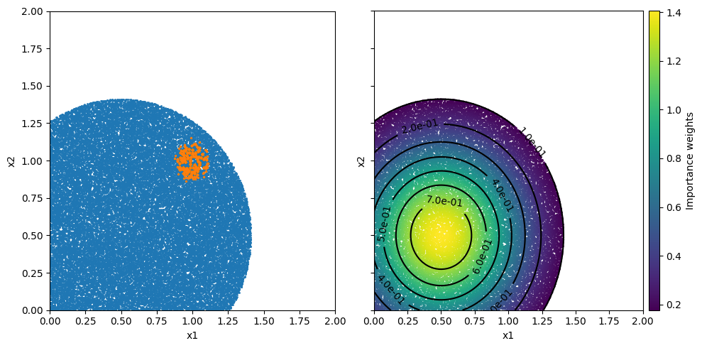
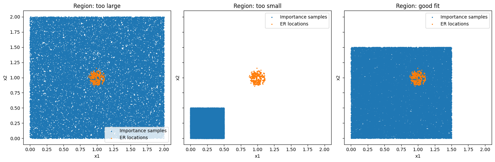
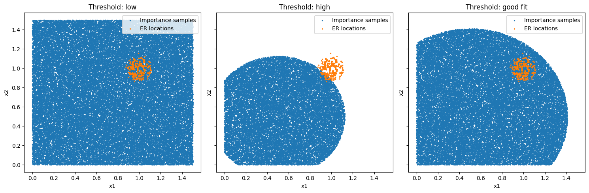

# Importance sampling

## Overview

Importance sampling is a technique that helps to focus computational effort on the most *important* parts of the input space — typically rare conditions that have a large effect on the result.

This document explains what importance sampling is, how it works in `axtreme`, how to choose parameters, and what risks to be aware of.

A full working example can be found in `tutorials/importance_sampling.py`.

## Purpose and Motivation

When estimating a quantity of interest (QoI) using random samples from the environment, most samples describe *common* conditions — not the *rare* conditions that may actually drive extreme responses. Importance sampling deliberately takes more samples from rare but important regions (e.g., extreme weather) and then re-weights them to stay statistically correct, i.e. to stay aligned with the distribution of the environment.

Imagine wanting to estimate if an offshore wind farm survives extreme wave conditions:
- **Normal sampling:** Most samples are calm conditions. → You need to use a large amount of samples from the environment to get samples from extreme conditions.

*Figure 1: This figure shows environment data with the location of the extreme response marked in orange. In this case, most of the data is concentrated around $(x_1,x_2)=(0.5,0.5)$ while in the area where the extreme response occurs the data is more spread out. This means that more data needs to be incorporated to include these rarer events.*

- **Importance sampling:** You focus on extreme conditions, then correct for the fact that you sampled them more often. → Less uncertain estimate with less samples.

*Figure 2: The left figure shows importance samples in blue and again the location of the extreme response in orange. How the area for the samples is chosen is explained later but what we can see is that the samples cover the area evenly which also means that there are a significant amount of samples near the extreme response location. The second figure shows the importance samples colord according to their weight and contour lines for the environment probability density function (pdf). This shows that the weights are the largest were the pdf has its largest values.*

In summary, importance sampling re-allocates sampling effort towards the regions that matter most, significantly reducing estimation uncertainty for the same computational budget, making it particularly valuable for expensive simulations.

## How it works in Axtreme

`axtreme` provides two ways to generate importance samples and weights:

| Option | Function | When to Use | Key Inputs |
|---------|-----------|-------------|-------------|
| **1. Known Importance Distribution** | `importance_sampling_from_distribution` | You know (or can estimate) the importance sampling distribution using domain knowledge. | `env_distribution_pdf`, `importance_distribution_pdf`, `importance_sampling_sampler`, `num_samples` |
| **2. Uniform Region Sampling** | `importance_sampling_distribution_uniform_region` | You don’t know the importance distribution but can define a region where extreme responses likely occur. | `env_distribution_pdf`, `region`, `threshold`, `num_samples_total` |

### Parameters
#### Option 1: Sampling from a Known Importance Distribution
- **env_distribution_pdf**: The pdf function of the real environment distribution. This can either be a known function
            or for example be estimated based on the environment data using KDE (kernel density estimation).
- **importance_distribution_pdf**: The pdf function of the importance sampling distribution.
- **importance_sampling_sampler**: The sampler for producing samples from the importance sampling distribution.
- **num_samples**: The number of samples to generate.

#### Option 2: Uniform Sampling in a Region
- **env_distribution_pdf**: The pdf function of the real environment distribution. This can either be a known function
            or for example be estimated based on the environment data using KDE (kernel density estimation).
- **region**: The bounds of the region to generate samples from.
- **threshold**: The threshold basically defines which part of the region shall be ignored based on the probability of the environment data being lower than this threshold.
- **num_samples_total**: The number of samples to generate.

#### Choosing Parameters (Option 2)

##### Region

- **Too Large:** Wastes samples in irrelevant areas
- **Too Small:** Risks missing important extreme responses
- **Best Practice:** Use domain knowledge to choose the initial region.

In the following figure importance samples for different regions are shown. The extreme response locations are marked in orange.

*Figure 3: In the first plot we can clearly see that the region is too large as there are many samples far away from the important region. TIn the second plot shows that the region is too small as important areas of the environment space are missed. In the third plot all extreme responses are covered by the importance samples while still maintaining a reasonable amount of coverage of the space.*

💡 *Best practice:* If unsure, start with a larger region — you’ll get correct but less efficient results.

##### Threshold

- **Too Low**: Samples entire region inefficiently
- **Too High**: May miss important areas
- **Optimal**: Covers extreme responses while maintaining efficiency

*Figure 4: In the first plot the threshold is very low and as a consequence the whole region is sampled which means that the pdf values have little to no impact. In the second plot the threshold is too high as important areas of the environment space are missed. In the third plot all extreme responses are covered by the samples. Thereby, we conclude that this is a good fit for this example.*

💡 *Best practice:* If unsure, start with a too low threshold — you’ll get correct but less efficient results.

You can experiment with increasing the threshold or decreasing the size of the region until you see the produced estimate change because you have now excluded important environment regions.

## Risks and Common Pitfalls

Keep these points in mind:

| Risk | Description | Mitigation |
|------|--------------|-------------|
| **Biased results** | Missing regions where the extreme response occurs | Start with a larger region or lower threshold |
| **Overconfidence** | Estimates look precise but are wrong because key areas were excluded | Test sensitivity by expanding the region or lowering the threshold |

✅ **Safe fallback:**
If unsure, use a *larger region* and *lower threshold*. This will be slower but ensures valid results.

## References & Further Reading

- Winter, S. et al. (2025) “Efficient Long-Term Structural Reliability Estimation with Non-Gaussian Stochastic Models: A Design of Experiments Approach.” arXiv. Available at: [https://doi.org/10.48550/arXiv.2503.01566](https://doi.org/10.48550/arXiv.2503.01566).
- `axtreme` Tutorials:
  - `tutorials/basic_example.py`
  - `tutorials/importance_sampling.py`